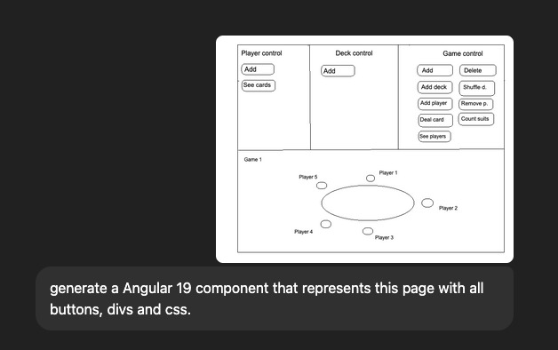

# GO_TO Game Deck challenge

## Description

Implementation of a Game deck based on requirements provided. In this project there is the backend and front end that could be run together for test.

## Backend 

This project uses the following technologies:
- Java 21 with Spring Boot for building RESTful APIs
- Maven for dependency management and build automation
- H2 in-memory database for development and testing
- MapStruct for object mapping to not expose entities in the rest api
- Lombok to reduce boilerplate code
- JPA (Jakarta Persistence API) for ORM and database access

### To run

Just run `DeckGameApplication.java` class. If you don't provide a env var `APP_TOKEN` for the api validations, the default used is `default-token`, which was included just to make easier to test, but in real live, no default should be provided


Go to `http://localhost:8080/swagger-ui/index.html` for Swagger api to call endpoints

Go to `http://localhost:8080/h2-console/login.do` for in memory DB ui and see the data

## Frontend

This project uses the following technologies:
- Node 22
- Angular 19

### To run

```
nvm use
npm install
npm run start
```

Go to `http://localhost:4200` to play with the app

## BD Diagram


## AI Usage

Lot of code to be generated for this challenge in a short period of time, so AI is a good help on those cases since the boilerplate code is pretty much the same. Used ChatGPT to generate a good part of this code where I reviewed them and changed to better fit the structure I wanted or to fix some issues.

Even for the UI, started doing a mockup of what I wanted and asked ChatGpt to generate the code for me, than got the code and adpted on the project



For the DB diagram, presented the ChatGpt my entities and asked for a DB diagram which resulted in a python script to generate it (pretty nice).

## Checklist

 - [x] API backend
   - [x] Requirements implementation: Tried to follow a package structure that separates principal domains (game, deck, player) and maybe apply Spring Monolith to avoid exposing unnecessary classes to the whole project, with rules validating each package but I'm not sure I liked the way I did. Would need a little more time to rethink about it and handle it better.
   - [x] Security: For the purpose of this challenge, just added a api key header that need to be sent to call this endpoint to avoid making them public. But ideally, Spring Security could play a role in here where we could add token validation and different permissions for each endpoint
   - [x] Error handling: Partially implemented, added some exceptions and validations but that are still some TODOs in the code to be implemented
   - [ ] Rule Validations: Not implemented. Many rules to handle so left some TODOs in the code
   - [ ] Concurrency handling: Not implemented, but basically we could have issues if we call the dealCards in parallel for the same or different users. There is also an issue while shuffiling the deck and dealing cards at the same time. We could use some lock on a game to handle that, or maybe just a @Version on the entity for optimistic locking is enough, anyway, need a little more analyses
   - [x] Database: Used H2 just for simplicity, entities are mapped but need to review relationships and constraints more carefully.
       - Also the cascade operations, pretty sure it can cause some weird behaviors
       - For PK, used long with generated values. Exposing them in API is not good because or id enumeration. So we could have an UUID as external id to return in API instead. Using UUID as PK could also be a possibility.
   - [x] Unit/IT tests: Partially implemented. Added some tests for:
     - Config: ApplicationTokenConfig has a test that is a good example on how we could test spring configuration to make sure all annotations are in the right place and well configured.
     - Controllers: DeckController has a test and it test that is a good example of how we could test controllers using MockMvc to simulate HTTP requests and validate responses.
     - Services and others: Not implemented but definitely need to be done.
 - [x] Frontend
   - [x] Views
   - [ ] Tests
   - [ ] Translations/I18n: I won't have time to do it but could integrate a lib with angular that extract the text automatically and put in a en.json file that we could export to Transifex or something like that to get translated and then pulled back to some place were we can fetch and add to the project or dinamically load it.
   - [ ] Error handling and message: No time to this one too, so if operations fails, just check Chrome debug to see the request response. 
  
