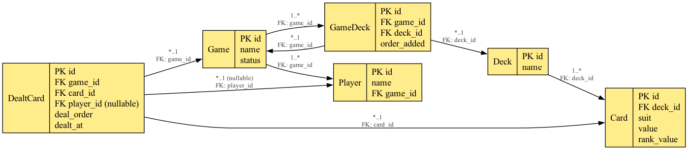

# GO_TO Game Deck challenge

## Description

Implementation of a Game deck based on requirements provided.

## Backend 

This project uses the following technologies in the backend:
- Java 21 with Spring Boot for building RESTful APIs
- Maven for dependency management and build automation
- H2 in-memory database for development and testing
- MapStruct for object mapping to not expose entities in the rest api
- Lombok to reduce boilerplate code
- JPA (Jakarta Persistence API) for ORM and database access

## BD Diagram

## Checklist

 - [x] API backend
   - [x] Requirements implementation: Tried to follow a package structure that separates principal domains (game, deck, player) and maybe apply Spring Monolith to avoid exposing unnecessary classes to the whole project, with rules validating each package but I'm not sure I liked the way I did. Would need a little more time to rethink about it and handle it better.
   - [x] Security: For the purpose of this challenge, just added a api key header that need to be sent to call this endpoint to avoid making them public. But ideally, Spring Security could play a role in here where we could add token validation and different permissions for each endpoint
   - [x] Error handling: Partially implemented, added some exceptions and validations but that are still some TODOs in the code to be implemented
   - [ ] Rule Validations: Not implemented. Many rules to handle so left some TODOs in the code
   - [ ] Concurrency handling: Not implemented, but basically we could have issues if we call the dealCards in parallel for the same or different users. There is also an issue while shuffiling the deck and dealing cards at the same time. We could use some lock on a game to handle that, or maybe just a @Version on the entity for optimistic locking is enough, anyway, need a little more analyses
   - [x] Unit/IT tests: Partially implemented. Added some tests for:
     - Config: ApplicationTokenConfig has a test that is a good example on how we could test spring configuration to make sure all annotations are in the right place and well configured.
     - Controllers: DeckController has a test and it test that is a good example of how we could test controllers using MockMvc to simulate HTTP requests and validate responses.
     - Services and others: Not implemented but definitely need to be done.
 - [ ] Frontend
   - [ ] Views
   - [ ] Tests
